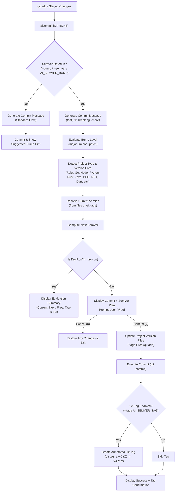

# Implementation Plan: Optional SemVer Evaluation, Multi-Language Version Update & Git Tagging

## Goal Description
Enhance `aicommit` to support **optional Semantic Versioning (SemVer) evaluation and automated release management**. When opted in (via CLI flag `--bump`/`--semver` or configuration), `aicommit` will:
1. **Evaluate SemVer Bump Level**: Classify the changes allowed to be committed (using the Conventional Commit message in process: `major` for breaking changes/`!`, `minor` for `feat`, `patch` for `fix`/`perf`, or user-specified override).
2. **Detect & Resolve Current Version**: Inspect project-specific manifest/version files or existing Git tags to determine the current SemVer.
3. **Compute Next SemVer**: Increment the version according to standard SemVer specifications.
4. **Update Version Files**: Update version declarations across popular ecosystems (Ruby/Rails, Go, PHP, .NET, Node.js, Python, Rust, Java/JVM, Dart/Flutter, and generic version files).
5. **Stage & Commit**: Stage the updated version files alongside the commit in progress so the repository state matches the released version.
6. **Create Git Tag**: Create an annotated git tag (e.g., `v1.2.0`) pointing to the newly created commit.
7. **Support Dry-Run Preview**: In `--dry-run` mode, display the full evaluation (current version, evaluated bump, target version, files to update, and git tag) with zero modifications.

---

## User Review Required

> [!IMPORTANT]
> **Opt-in Design**: Version evaluation and modification of manifest files and git tags is strictly **opt-in** so normal commits are never unexpectedly tagged or version-bumped. Users opt in using `--bump` (or `--semver`, with optional level `--bump=minor`), or by setting `AI_SEMVER_BUMP=true` in `~/.aicommitrc`.

> [!WARNING]
> **Atomic Commit Inclusions**: When version bump is active, updated version files (e.g., `package.json`, `.gemspec`, etc.) are staged into the **same commit** as the code changes being committed, ensuring that the commit tagged with `vX.Y.Z` contains the corresponding version string. If the user cancels the commit prompt, modified files are automatically restored to their previous clean state.

> [!NOTE]
> **Go Ecosystem SemVer Specifics**: As Go modules strictly follow Git tag-based versioning (Minimal Version Selection) and do not store module versions in `go.mod`, Go projects will primarily receive the standard Git tag (`vX.Y.Z`). If a Go project contains a custom version file (e.g., `version.go` with `var Version = "..."`), that file will also be updated.

---

## Open Questions

> [!IMPORTANT]
> Please review and confirm your preferences for the following design choices:

1. **Tag Prefix Preference**: Standard conventions use `v` prefix (e.g. `v1.2.3`), which is standard across Go, Node.js, GitHub releases, and Ruby.
   - Proposed default: `v${VERSION}` with configuration override `AI_SEMVER_TAG_PREFIX="v"` (or `""` for prefix-less `1.2.3`).
2. **Behavior on Non-Functional Commits (`chore`, `docs`, `refactor`, `test`, `style`)**:
   - When `--bump` is explicitly passed without a level, but the commit message is `chore: ...` (which Conventional Commits classifies as `none`):
     - Proposed default: Prompt user or fallback to `patch` (configurable via `AI_SEMVER_DEFAULT_BUMP=patch`), because passing `--bump` indicates an explicit intent to produce a version bump.
3. **Split Mode (`--split` / `aicc`) with `--bump`**:
   - In atomic split commits, calculate the SemVer bump for **each atomic individual commit** based on its specific scope and message.
   - For each atomic commit, update the project version file(s) and create a git tag for each atomic individual commit.

---

## Architecture & Data Flow



---

## Supported Ecosystems & Manifest Files

| Language / Ecosystem | Manifest & Version Files | Version Pattern & Replacement Strategy |
| :--- | :--- | :--- |
| **Node.js / JS / TS** | `package.json`<br/>`package-lock.json` | Top-level `"version": "X.Y.Z"` and lockfile `packages[""]` |
| **Python** | `pyproject.toml`<br/>`setup.py`<br/>`setup.cfg`<br/>`*/__version__.py`<br/>`*/__init__.py` | `version = "X.Y.Z"`, `version='X.Y.Z'`, `__version__ = "X.Y.Z"` |
| **Ruby & Rails** | `*.gemspec`<br/>`lib/**/version.rb`<br/>`config/version.rb` | `spec.version = "X.Y.Z"`, `VERSION = "X.Y.Z"` |
| **Go (Golang)** | Git tags (`vX.Y.Z`)<br/>`version.go` / `pkg/version/*.go` (if present) | Git tag `vX.Y.Z` (Go toolchain standard). If `var/const Version = "X.Y.Z"` exists, update code file. |
| **PHP (Composer)** | `composer.json` | `"version": "X.Y.Z"` (if present) + Git tag `vX.Y.Z` |
| **.NET (C# / F#)** | `*.csproj`<br/>`*.fsproj`<br/>`Directory.Build.props` | `<Version>X.Y.Z</Version>` / `<PackageVersion>X.Y.Z</PackageVersion>` |
| **Rust** | `Cargo.toml` | Under `[package]`: `version = "X.Y.Z"` |
| **Java / JVM** | `pom.xml`<br/>`build.gradle`<br/>`build.gradle.kts` | Maven `<version>X.Y.Z</version>`, Gradle `version = 'X.Y.Z'` |
| **Dart / Flutter** | `pubspec.yaml` | `version: X.Y.Z` or `version: X.Y.Z+build` |
| **Generic / Others** | `VERSION`, `.version` | Plain-text `X.Y.Z` or Git tag fallback if no file exists |

---

## Proposed Changes

### Component 1: SemVer Engine (`lib/semver.sh`)

#### [NEW] `lib/semver.sh`
Create a modular library for all SemVer and project-version operations:
- `detect_version_files()`: Detects all version-bearing files in the project.
- `get_current_version()`: Extracts current SemVer from files or highest git tag (fallback: `0.1.0`).
- `calculate_next_semver(current_version, bump_level)`: Increments `major`, `minor`, or `patch`.
- `update_version_in_file(file, old_ver, new_ver)`: Updates version in file with portable safe in-place replacement (avoids BSD/GNU sed differences).
- `evaluate_semver_bump(commit_msg, explicit_level)`: Maps conventional commit to bump level (`major`/`minor`/`patch`).
- `apply_semver_file_updates(old_ver, new_ver)`: Performs updates on all detected version files and stages them.
- `create_version_tag(version, commit_msg)`: Creates annotated git tag `v${version}`.
- `display_semver_plan(current_ver, bump, next_ver, tag, files)`: Nicely formatted terminal output.

```bash
# Example core logic in lib/semver.sh:

calculate_next_semver() {
    local cur="$1" bump="$2"
    cur="${cur#v}" # strip leading v if present
    
    local major minor patch
    major=$(echo "$cur" | awk -F'[.-]' '{print $1}')
    minor=$(echo "$cur" | awk -F'[.-]' '{print $2}')
    patch=$(echo "$cur" | awk -F'[.-]' '{print $3}')
    
    major="${major:-0}"; minor="${minor:-0}"; patch="${patch:-0}"
    # strip any non-digit suffix (e.g. +build or -beta) for base increment
    patch="${patch%%[^0-9]*}"
    
    case "$bump" in
        major) major=$((major + 1)); minor=0; patch=0 ;;
        minor) minor=$((minor + 1)); patch=0 ;;
        patch) patch=$((patch + 1)) ;;
        *) ;;
    esac
    echo "${major}.${minor}.${patch}"
}
```

---

### Component 2: Configuration & Defaults (`config/defaults.sh`)

#### [MODIFY] `config/defaults.sh`
Add SemVer configuration variables:
```bash
# Semantic Versioning & Tagging
AI_SEMVER_BUMP="${AI_SEMVER_BUMP:-false}"
AI_SEMVER_TAG="${AI_SEMVER_TAG:-true}"
AI_SEMVER_TAG_PREFIX="${AI_SEMVER_TAG_PREFIX:-v}"
AI_SEMVER_DEFAULT_BUMP="${AI_SEMVER_DEFAULT_BUMP:-patch}"
```

---

### Component 3: CLI & Commit Workflow (`aicommit.sh`)

#### [MODIFY] `aicommit.sh`
1. Source `lib/semver.sh`:
   ```bash
   source "$AICOMMIT_DIR/lib/semver.sh"
   ```
2. Parse new CLI flags:
   - `--bump[=LEVEL]`, `-b`
   - `--semver[=LEVEL]`
   - `--tag` / `--no-tag`
3. Update `--help` usage documentation.
4. In `dry_run` branch:
   If semver bump opted: evaluate bump and display preview of planned version updates and tag.
5. In commit execution branch:
   - If semver bump opted:
     - Run `apply_semver_file_updates "$current_ver" "$next_ver"` to update files and `git add` them.
     - Execute commit (`process_commit "$commit_msg"`).
     - Run `create_version_tag "$next_ver" "$commit_msg"`.
     - Display tag confirmation.
   - If user edits commit message (`e`): re-evaluate bump from edited message before committing.
   - If user cancels (`n`): revert modified version files (`git checkout -- "${updated_files[@]}"`).

---

### Component 4: Context Analyzer & Output Formatter (`lib/context-analyzer.sh`, `lib/output-formatter.sh`)

#### [MODIFY] `lib/context-analyzer.sh`
- Extend `detect_project_type()` to recognize:
  - `php` (`composer.json`)
  - `dotnet` (`*.csproj`, `*.fsproj`)
  - `dart/flutter` (`pubspec.yaml`)
  while preserving existing detection precedence.

#### [MODIFY] `lib/output-formatter.sh`
- Add `display_semver_plan()` and `display_tag_success()` helpers for user-friendly UI formatting.

---

### Component 5: Completions & Shell Shims

#### [MODIFY] `completions/_aicommit`, `completions/aicommit.bash`
Add completion flags for `--bump`, `--semver`, `--tag`, `--no-tag`.

---

### Component 6: Test Suite & Helpers

#### [MODIFY] `test/test_helper.sh`
- Ensure `HOME` is isolated to `$TEST_TEMP_DIR` in `setup_test_env` and restored in `cleanup_test_env`, resolving sandboxed test permissions for `$HOME/.aicommitrc`.

#### [NEW] `test/unit/test_semver.bats`
Add comprehensive unit tests:
1. `calculate_next_semver` for `major`, `minor`, `patch` across various input formats (`1.0.0`, `v2.4.9`, `0.0.1+build`).
2. `get_current_version` from manifest files (`package.json`, `Cargo.toml`, `pyproject.toml`, `pubspec.yaml`, `composer.json`, `*.gemspec`, `version.rb`, `*.csproj`, `pom.xml`, `build.gradle`, `VERSION`).
3. `get_current_version` fallback to git tags (`v1.2.3` -> `1.2.3`).
4. `detect_version_files` across all ecosystems.
5. In-place version string replacement tests for every supported language/framework manifest.
6. `create_version_tag` verifies git tag creation and message.
7. Rollback verification on cancelled commit.

#### [MODIFY] `test/contexts/smoke.bats`, `test/contexts/integration.bats`
- Add checks for `lib/semver.sh` functions in smoke tests.
- Add end-to-end integration tests for `aicommit --bump` in real git repositories.

---

## Verification Plan

### Automated Tests
Run all test suites using BATS:
```bash
# 1. Run new SemVer unit tests
bats test/unit/test_semver.bats

# 2. Run existing unit tests to prevent regressions
bats test/unit/*.bats

# 3. Run all test categories via runner
./test/run_tests.sh
```

### Manual Verification
1. **Node.js Project Verification**:
   - Create test repo with `package.json` (`"version": "1.0.0"`).
   - Stage a feature change.
   - Run `aicommit --bump --dry-run` -> verify preview displays `1.0.0 -> 1.1.0 (minor)`, tag `v1.1.0`.
   - Run `aicommit --bump --yes` -> verify `package.json` contains `"1.1.0"`, commit includes `package.json`, and `git tag -l` shows `v1.1.0`.
2. **Ruby / Rails Project Verification**:
   - Create test repo with `test.gemspec` and `lib/test/version.rb`.
   - Stage a fix change (`fix: bug in auth`).
   - Run `aicommit --bump --yes` -> verify both files updated to next patch, tag created.
3. **Go Project Verification**:
   - Create test repo with `go.mod` and tag `v0.5.0`.
   - Stage a breaking change (`feat!: change API signature`).
   - Run `aicommit --bump --yes` -> verify git tag `v1.0.0` created without modifying `go.mod`.
4. **Python Project Verification**:
   - Create test repo with `pyproject.toml` (`version = "0.2.1"`).
   - Stage a feature change -> verify version updated to `0.3.0` and tag `v0.3.0` created.
5. **Rust & Java & PHP & .NET & Dart Verification**:
   - Test `Cargo.toml`, `pom.xml`, `composer.json`, `*.csproj`, `pubspec.yaml` updates.
6. **Cancel / Rollback Verification**:
   - Run `aicommit --bump`, answer `n` at prompt -> verify working directory remains intact with original versions.
